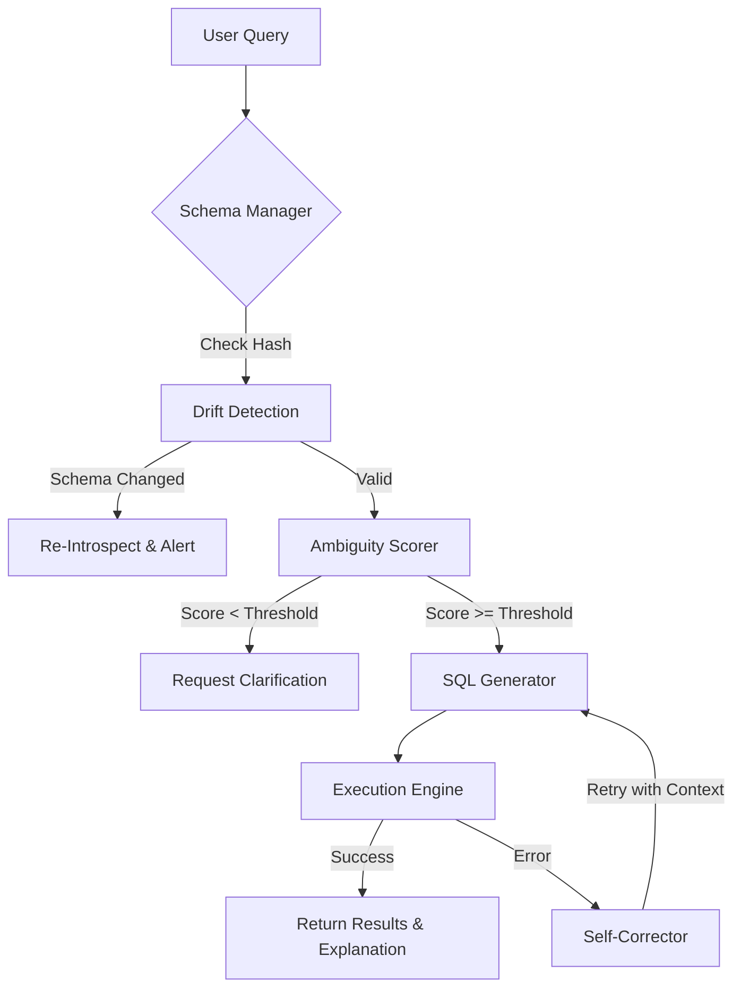

# 🔍 QuerySense: Intelligent NL-to-SQL Engine


> **Enterprise-grade Natural Language to SQL generation with self-correction, ambiguity detection, and schema drift awareness.**

QuerySense is a sophisticated AI-powered system that translates plain English questions into executable SQL queries. Unlike basic text-to-SQL wrappers, QuerySense acts as an intelligent agent: it scores queries for ambiguity, explains its reasoning step-by-step, self-corrects when queries fail, and actively monitors the database for underlying schema changes (schema drift).

---

## ✨ Key Features

- 🧠 **Smart NL-to-SQL Generation**: Ask complex questions in plain English and get highly optimized, accurate SQL queries in return.
- 🔄 **Self-Correction Engine**: If a generated query fails (e.g., syntax error, invalid column), the engine automatically captures the database error context, passes it back to the LLM, and self-corrects the query autonomously.
- 🛡️ **Schema Drift Detection**: Constantly monitors the database schema using hash-based fingerprinting. If the underlying database structure changes, the system detects the "drift", alerts the user, and re-introspects the schema to maintain accuracy.
- 🚦 **Ambiguity Scoring & Thresholding**: Enforces strict ambiguity checks. Vague or incomplete queries trigger a clarification request before attempting to generate potentially destructive or incorrect SQL.
- 💬 **Conversational Context**: Maintains memory of the session, allowing users to ask follow-up questions (e.g., "now filter that by last month") seamlessly.
- 📊 **Query Analytics Engine**: Provides rich telemetry on query performance, categorization, token usage, and system intelligence scores.
- 🔍 **Reasoning Transparency**: Every generated SQL query is accompanied by a plain-English explanation of the steps taken to arrive at that logic.

---

## 🏗️ Architecture Flow



---

## 🚀 Quick Start

### 1. Clone the Repository
```bash
git clone https://github.com/anshumaansingh0607/QuerySense.git
cd QuerySense
```

### 2. Backend Setup
```bash
cd backend
python -m venv venv

# Activate Virtual Environment
# On Windows:
venv\Scripts\activate
# On macOS/Linux:
source venv/bin/activate

pip install -r requirements.txt
```

### 3. Environment Configuration
Create a `.env` file in the `backend` directory:
```env
# Choose: openai, anthropic, or mock (for testing without API keys)
LLM_PROVIDER=openai
OPENAI_API_KEY=sk-your-openai-api-key

# Optional: Adjust the strictness of the ambiguity checker (0.0 to 1.0)
AMBIGUITY_THRESHOLD=0.7
```

### 4. Run the Application
Start the backend server (FastAPI):
```bash
python -m uvicorn app.main:app --reload --port 8000
```
Then, open `frontend/index.html` in your web browser.

---

## 📖 API Reference

### Core Endpoints

| Method | Endpoint | Description |
|---|---|---|
| `POST` | `/api/query` | Submits a natural language query for SQL generation. |
| `POST` | `/api/query/clarify` | Submits a response to an ambiguity clarification request. |
| `GET`  | `/api/history` | Fetches the recent conversational query history. |

### Schema & Drift Endpoints

| Method | Endpoint | Description |
|---|---|---|
| `GET`  | `/api/schema/status` | Checks current schema drift status (hash validation). |
| `POST` | `/api/schema/refresh` | Forces a hard refresh of the schema introspection. |
| `GET`  | `/api/schema/tables` | Retrieves available tables, columns, and relationships. |
| `POST` | `/api/schema/simulate-drift` | *Demo only:* Artificially alters a table to simulate drift. |

---

## 🛠️ Tech Stack

- **Backend Platform**: Python 3.11+, FastAPI
- **Database Mapping**: SQLAlchemy, SQLite (Ready for PostgreSQL/MySQL integration)
- **Frontend**: Vanilla JavaScript, HTML5, Modern CSS (Glassmorphism UI)
- **AI/LLM Integration**: Provider-agnostic routing (OpenAI, Anthropic, Mock)
- **Architecture**: Modular domain-driven design, asynchronous execution

---

## 🤝 Contributing

Contributions, issues, and feature requests are welcome! Feel free to check the [issues page](https://github.com/anshumaansingh0607/QuerySense/issues).

1. Fork the Project
2. Create your Feature Branch (`git checkout -b feature/AmazingFeature`)
3. Commit your Changes (`git commit -m 'Add some AmazingFeature'`)
4. Push to the Branch (`git push origin feature/AmazingFeature`)
5. Open a Pull Request

---

## 📄 License

Distributed under the MIT License. See `LICENSE` for more information.
